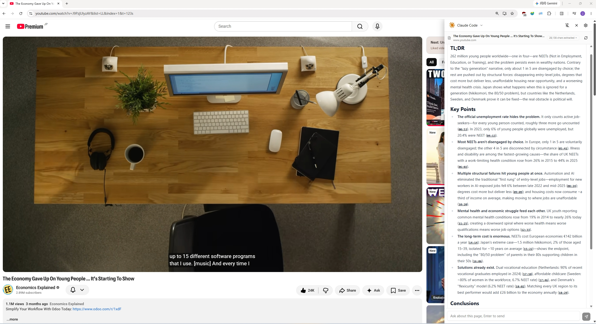
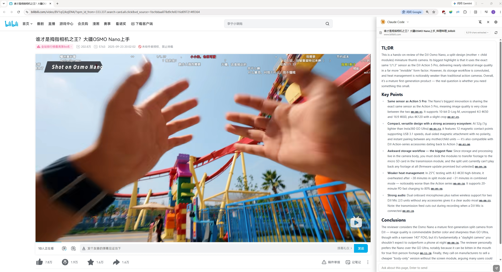
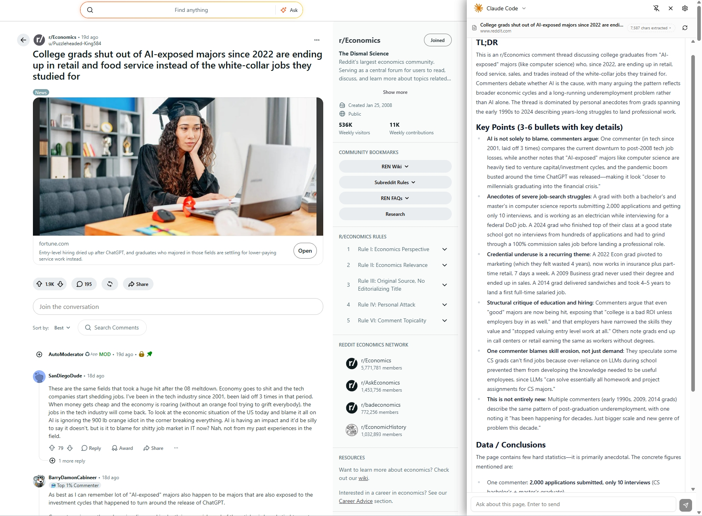

<div align="center">

<sub></sub>

# WebSideChat

### Chat with any web page or video using your favorite AI.

**Extract, summarize, and explore in one click. Zero ads, pure insight.**

English | [简体中文](README_ZH.md)

**[Features](#features) · [Screenshots](#screenshots) · [Manual Installation](#manual-installation) · [Plugin Configuration](#plugin-configuration) · [Development](#development)**

</div>

WebSideChat is a lightweight browser extension: extract the content of any web page or video in one click, then chat with it using your favorite AI.

WebSideChat summarizes pages and videos, so you get the knowledge fast and skip the ads.

WebSideChat answers questions about whatever you're reading or watching.

## Features

- **Easy setup** — Compatible with Claude Code, Codex, and OpenCode configs. One config, used everywhere; supports DeepSeek, Zhipu and many more providers & AI relays.
- **Video Chat** — Works with YouTube and Bilibili: extract key points fast, skip the ads, and ask questions about the video content.
- **Follow-up questions** — Page content stays as persistent context, so you can keep asking about the page.
- **Custom prompts** — Edit the summary instructions; restore the built-in defaults anytime.
- **Parallel tabs** — Each tab is an independent session and stream: chat in multiple tabs without interference.
- **Bilingual UI** — Chinese & English, following your browser language by default (switchable in settings); summary output language is configured separately.

## Screenshots

| YouTube | Bilibili | Web Page |
| :---: | :---: | :---: |
|  |  |  |


## Manual Installation

1. Download the latest `websidechat-vX.Y.Z-chrome.zip` from the [Releases](https://github.com/Zhang1933/WebSideChat/releases) page
2. Unzip it to any folder (keep the folder — don't delete it)
3. Open `chrome://extensions` in Chrome → enable **Developer mode** (top right) → **Load unpacked** → select the **unzipped folder**

## Plugin Configuration

After installing, click the extension icon to open the sidebar and follow the guide to add an AI provider — just like configuring [cc-switch](https://github.com/farion1231/cc-switch) or any agent tool.

## Development

```bash
npm install
npm run dev        # WXT dev server; opens Chrome with the extension loaded
npm test           # vitest unit tests (SSE parsing, conversation LRU, URL normalization)
npm run compile    # tsc type check
npm run build      # builds to .output/chrome-mv3/
npm run zip        # packages .output/*.zip (for distribution)
```

## License

[CC BY-NC 4.0](./LICENSE) © Zhang1933

This project is licensed under [Attribution-NonCommercial 4.0 International](https://creativecommons.org/licenses/by-nc/4.0/): free to use, modify and share with attribution — **commercial use is prohibited**.
