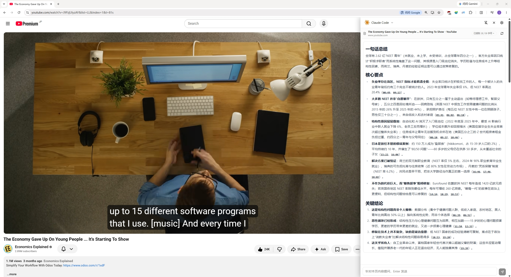
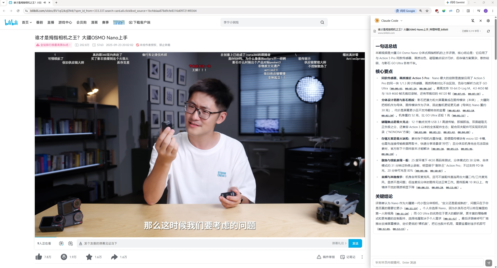
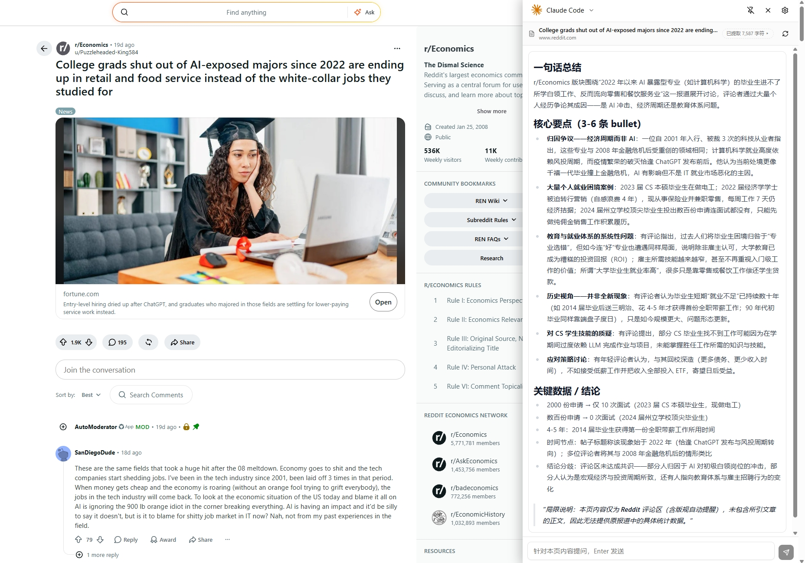

<div align="center">

<sub></sub>

# WebSideChat

### 用你喜欢的 AI，与网页和视频对话

**一键提取网页及视频内容，快速总结、随时提问。远离广告噪音，快速获取知识，专注内容本身。**

[English](README.md) | 简体中文

**[功能](#features) · [界面预览](#screenshots) · [手动安装](#manual-installation) · [插件配置](#plugin-configuration) · [开发](#development)**

</div>

WebSideChat，一个简单的浏览器扩展，一键提取网页、视频内容，用你喜欢的AI与网页对话。

WebSideChat，帮你总结网页、视频内容，快速获取知识并免去广告。

WebSideChat，回答你网页上、视频中小小的疑问。

## <a id="features"></a>功能

- **简单订阅及配置**：一份订阅与配置，多处使用，兼容Claude Code、Codex、OpenCode等工具配置，支持DeepSeek， 智谱等多供应商与AI中转站。
- **视频Chat**：支持 YouTube 与 B站视频，快速提炼视频要点，免看广告，针对视频内容进行提问。
- **多轮追问**：网页正文作为常驻上下文，针对本页内容连续提问
- **提示词自定义**：可编辑内容摘要指令，支持恢复内置默认
- **多标签页并行**：每个标签页是独立会话与独立流，可同时在多个标签页对话，互不打扰。

## <a id="screenshots"></a>界面预览

| 油管总结 | B站总结 | 网页总结 |
| :---: | :---: | :---: |
|  |  |  |

## <a id="manual-installation"></a>手动安装

1. 从 [Releases](https://github.com/Zhang1933/WebSideChat/releases) 页面下载最新版的 `websidechat-vX.Y.Z-chrome.zip`
2. 解压 zip 到任意文件夹（保留该文件夹，不要删除）
3. Chrome 打开 `chrome://extensions` → 打开右上角"开发者模式" → "加载已解压的扩展程序" → 选择**解压后的文件夹**

## <a id="plugin-configuration"></a>插件配置

安装好后，点击插件图标，打开插件侧边栏，按照引导添加AI供应商即可，就像在配置 [cc-switch](https://github.com/farion1231/cc-switch) 或各种agent工具一样。

## <a id="development"></a>开发

```bash
npm install
npm run dev        # 起 WXT dev server，自动打开 Chrome 加载扩展
npm test           # vitest 单测（SSE 解析、会话 LRU、URL 规范化）
npm run compile    # tsc 类型检查
npm run build      # 产物 .output/chrome-mv3/
npm run zip        # 打包 .output/*.zip（可上架/分发）
```

## 许可证

[CC BY-NC 4.0](./LICENSE) © Zhang1933

本项目采用 [Attribution-NonCommercial 4.0 International](https://creativecommons.org/licenses/by-nc/4.0/) 协议：允许自由使用、修改与分发（需署名），**禁止任何商业用途**。
